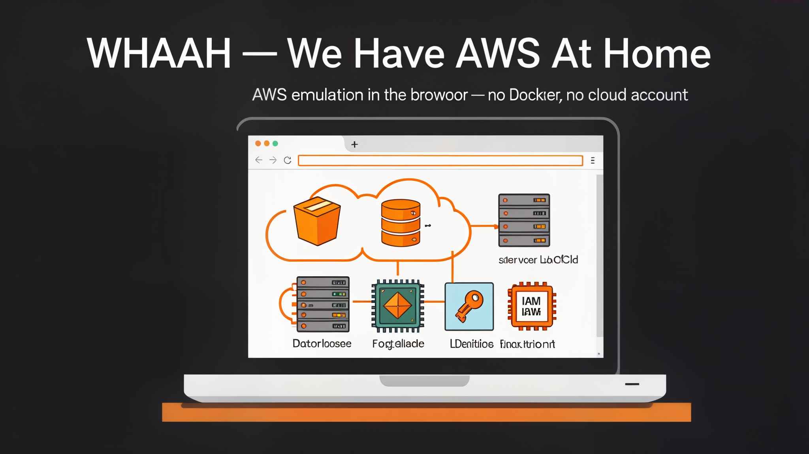

# WHAAH — *We Have AWS At Home*



> Un emulador de servicios de AWS que corre **100% en tu navegador**, sin servidor, sin Docker y sin tarjeta de crédito. Pensado para aprender AWS tocando los conceptos de verdad, no solo leyendo.

---

## ¿Qué es AWS y por qué emularlo?

Amazon Web Services (AWS) es la nube más usada del mundo: guardás archivos (S3),
corriendo bases de datos (DynamoDB), máquinas virtuales (EC2), funciones que
responden a eventos (Lambda) y controlás quién puede hacer qué (IAM).

El problema para quien arranca: abrir una cuenta real implica configurar
facturación, regiones, roles y mucho jargon. **WAHH te deja practicar la
*forma de pensar* de AWS** — buckets, tablas, instancias, funciones, permisos —
en una maqueta client-side que vive en tu propio navegador.

No es un clon de AWS. Es un **prototipo didáctico**: la lógica es la misma
(creás un bucket, subís un objeto, lo listás), pero la implementación es JS
puro y la "persistencia" es tu `localStorage`.

---

## Cómo correr WAHH sin Docker

No necesitás Docker ni nada instalado para lo básico:

**Opción A — solo abrir el archivo**
Abrí `index.html` en tu navegador (doble click). Como el proyecto usa módulos
ESM nativos del navegador, algunos navegadores bloquean `file://`. Si ves errores,
usá la Opción B.

**Opción B — servidor de desarrollo local (recomendada)**
Necesitás [Node.js](https://nodejs.org) (v18+). En la carpeta del proyecto:

```bash
npm install
npm run dev
```

Luego abrís `http://localhost:5173`. Eso levanta un servidor estático que sirve
el `index.html` y los módulos `src/`. **Nada se manda a ningún servidor**:
todo corre y se guarda en tu navegador.

> ¿Y el deploy? El repo está pensado para GitHub Pages. Mientras tanto, `npm run dev` alcanza para aprender.

---

## Mapa: qué servicio emula qué

| Servicio en WAHH | Servicio real de AWS | Para qué sirve en la vida real |
|------------------|----------------------|--------------------------------|
| **S3-like** (`s3`) | Amazon S3 | Almacenamiento de objetos (archivos, backups, sitios estáticos) |
| **Store** (`store`) | Amazon DynamoDB | Base de datos NoSQL clave-valor / documentos |
| **IAM** (`iam`) | AWS IAM | Identidad y acceso: usuarios, roles y permisos |
| **EC2** (`ec2`) | Amazon EC2 | Máquinas virtuales (servidores) con ciclo de vida |
| **Lambda** (`lambda`) | AWS Lambda | Funciones que se ejecutan ante un evento, sin servidor |

Cada servicio tiene su propia pestaña en la UI. La lógica de cada uno vive en
`src/services/<id>/`, aislada y testeada.

---

## Cómo aprender con WAHH

1. Abrí la UI y tocá cada pestaña: creá un bucket, una tabla, un usuario, una
   función, una instancia.
2. Leé `docs/tutorial.md`: explica cada servicio y trae **ejercicios
   progresivos**.
3. Cada ejercicio tiene un `*.test.js` stub en `docs/exercises/` que vos
   completás y verificás con:

   ```bash
   npm run test
   ```

   Si los tests pasan, tu solución está bien. Es TDD al revés: el test ya está,
   vos escribís el código que lo satisface.

---

## Estructura del proyecto

```
src/
  core/         storage + registry (infra base, no tocar)
  services/     s3 · store · iam · lambda · ec2   (la lógica de AWS)
    <id>/index.js   catálogo del servicio (id, nombre, clase, vista)
  ui/           shell con tabs + helper de vista + vistas por servicio
index.html      punto de entrada (se abre en el navegador)
docs/           diseño + tutorial pedagógico
```

---

## Tests

```bash
npm run test      # corre todos los tests (Vitest)
```

75 tests verdes cubren la lógica de los 5 servicios, el storage, el registry y
la UI. No hace falta saber testing para usar WAHH, pero si querés contribuir,
el flujo es TDD: test primero, luego código.
